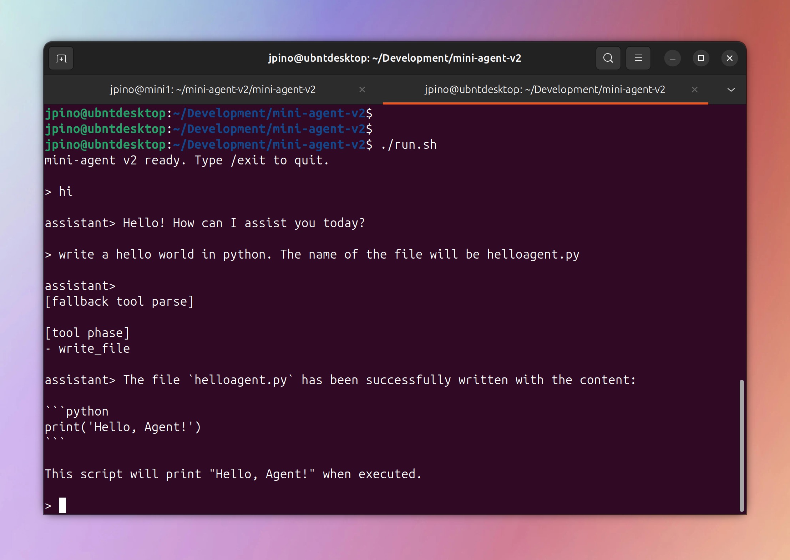

# 🤖 mini-agent



**A lightning-fast, ultra-lightweight local AI assistant designed specifically for older hardware.**

`mini-agent` is a terminal-first, fully offline AI agent built in Go that talks directly to your local Ollama instance. It provides seamless conversational chat alongside powerful local system actions (like reading/writing files and running commands)—all without the crushing overhead of heavy multi-agent frameworks.

---

## 🌟 Why This Matters

Most modern AI agent frameworks are brilliant, but they come with a massive footprint. They rely on vector databases, heavy RAG architectures, complex multi-agent orchestration, and web UIs. When you try to run them on older hardware (like a 2012 Mac Mini or an older Ubuntu home server), the CPU struggles, RAM maxes out, and the experience becomes painfully slow. 

**`mini-agent` solves this.** We stripped away everything except the absolute essentials:
- **Zero bloat:** No heavy Python frameworks, no vector DBs, no orchestration layers. Just a compiled Go binary talking directly to Ollama's HTTP API.
- **Built for small models:** Designed specifically to extract maximum utility out of small, fast models like `qwen2.5-coder:1.5b` and `gemma2:2b`.
- **Low resource footprint:** Keeps memory usage minimal and context windows tight to ensure snappy performance on CPU-only or older machines.

If you want a smart, capable local assistant that respects your system's resources, you are in the right place.

---

## 🛠️ How It Works (Design Decisions)

Making small, 1.5B - 3B parameter models reliably execute system actions is notoriously difficult. They often fail at standard "native tool-calling" APIs. To solve this, `mini-agent` uses a clever deterministic architecture:

1. **Strict Structured JSON Fallback:** Instead of relying on native tool-calling schemas that confuse small models, `mini-agent` prompts the model to output a strict JSON block when it wants to act. 
2. **Seamless Chat Interception:** As the model streams its response, the agent monitors the output. If it detects a tool call (JSON), it intercepts and hides the structured code from your terminal. You get a completely clean, human-friendly chat experience while the agent silently executes tasks in the background.
3. **Safety First:** Actions are heavily restricted. File operations are limited to plain text. Shell execution (`run_command`) operates on a strict whitelist of safe commands and **always** requires explicit `[y/N]` confirmation from the user before running.

---

## 🚀 Quick Start

### Prerequisites
- [Ollama](https://ollama.com/) installed and running locally.
- [Go](https://go.dev/) installed.
- Pull the recommended model: `ollama pull qwen2.5-coder:1.5b`

### Installation & Run

Clone the repository and run the setup script:

```bash
git clone https://github.com/josepino/mini-agent.git
cd mini-agent
chmod +x run.sh
./run.sh
```

*(Alternatively, you can just `go run ./cmd/mini-agent` or build the binary yourself).*

---

## 💡 Examples & Usage

Once the agent is running, just talk to it! It has persistent rolling memory, so it remembers the context of your conversation. 

**Chat and Ask Questions:**
> **You:** "What are the best practices for Go project structure?"

**Create and Edit Files:**
> **You:** "Create a Python script named `hello.py` that prints 'Hello World'."<br/>
> *The agent will silently generate the JSON, save the file, and respond to you naturally.*

**Read Files and Summarize:**
> **You:** "Read `README.md` and give me a 2-sentence summary."

**Run Safe Commands:**
> **You:** "Run `ls -la` to show me the files in this directory."<br/>
> *The agent will prompt you:* `Allow run_command: ls -la ? [y/N]:`

To exit the application, simply type `/exit`, `/quit`, or `/bye`.

---

## ⚙️ Configuration

`mini-agent` is highly customizable via the `config.yaml` file:

```yaml
ollama:
  host: "http://localhost:11434"
  model: "qwen2.5-coder:1.5b" # Change to gemma2:2b for a chat-only experience
  keep_alive: "30m"
  stream: true

tools:
  enabled: true
  use_native_tools: false # Set to true only if you upgrade to a large model (like llama3:70b)
  enable_read_file: true
  enable_write_file: true
  enable_run_command: true
  confirm_run_command: true
  allowed_commands:
    - cat
    - ls
    - pwd
    - grep
```

### Switching to Chat-Only Mode
If you want to use the agent strictly as a conversational partner without any system access, just set `tools.enabled: false` in `config.yaml`. This works beautifully with models like `gemma2:2b`.

---

## 🚧 Roadmap
- **Polish:** Enhance the terminal experience with colors and loading animations.
- **Hardware Tuning:** Continue benchmarking and tuning context windows to squeeze out even more performance on legacy Intel chips.

---
*Built with simplicity and speed in mind.*
