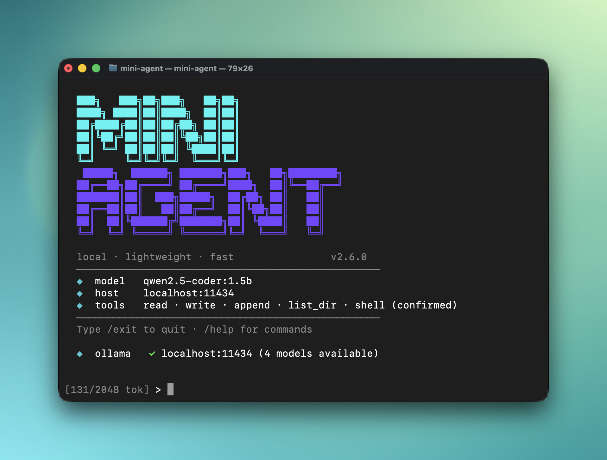

<div align="center">

<pre>
  ███╗   ███╗██╗███╗   ██╗██╗
  ████╗ ████║██║████╗  ██║██║
  ██╔████╔██║██║██╔██╗ ██║██║
  ██║╚██╔╝██║██║██║╚██╗██║██║
  ██║ ╚═╝ ██║██║██║ ╚████║██║
  ╚═╝     ╚═╝╚═╝╚═╝  ╚═══╝╚═╝
   █████╗  ██████╗ ███████╗███╗   ██╗████████╗
  ██╔══██╗██╔════╝ ██╔════╝████╗  ██║╚══██╔══╝
  ███████║██║  ███╗█████╗  ██╔██╗ ██║   ██║
  ██╔══██║██║   ██║██╔══╝  ██║╚██╗██║   ██║
  ██║  ██║╚██████╔╝███████╗██║ ╚████║   ██║
  ╚═╝  ╚═╝ ╚═════╝ ╚══════╝╚═╝  ╚═══╝   ╚═╝
</pre>

### Local AI agent for constrained hardware

[](https://go.dev)
[](LICENSE)
[](https://ollama.com)
[]()

**A lightweight Go CLI that connects to a local [Ollama](https://ollama.com) instance and gives you a fully capable AI agent — chat, autonomous goal execution, and file/shell tools — with zero cloud dependencies.**

Runs comfortably on hardware as old as a 2012 Mac Mini. No Python, no vector databases, no SaaS.

</div>

---



---

## Table of Contents

- [Why mini-agent](#why-mini-agent)
- [How it works](#how-it-works)
- [Features](#features)
- [Requirements](#requirements)
- [Installation](#installation)
- [Quick Start](#quick-start)
- [Usage](#usage)
  - [Chat mode](#chat-mode)
  - [Goal mode](#goal-mode)
  - [Non-interactive / scripts](#non-interactive--scripts)
  - [Injecting files into context](#injecting-files-into-context)
- [Commands](#commands)
- [CLI Flags](#cli-flags)
- [Configuration](#configuration)
- [Multi-Provider Support](#multi-provider-support)
- [Tools](#tools)
- [Telegram Bot](#telegram-bot)
- [Hardware Guide](#hardware-guide)
- [Project Context (CONTEXT.md)](#project-context-contextmd)
- [Session Persistence](#session-persistence)
- [Project Structure](#project-structure)
- [Contributing](#contributing)
- [License](#license)

---

## Why mini-agent

Modern AI agent frameworks are impressive, but they carry serious weight: Python runtimes, vector databases, orchestration layers, and web interfaces. On a 2012 Mac Mini, a Raspberry Pi 4, or a headless Ubuntu server with 8 GB of RAM, these frameworks saturate the CPU before the first prompt is answered.

The insight behind mini-agent is simple: **Ollama alone is fast on old hardware. Everything built on top of it doesn't have to be slow.**

mini-agent removes every unnecessary layer:

- A single compiled Go binary — no runtime, no dependencies to install
- Direct HTTP calls to Ollama — no SDK, no abstraction overhead  
- A tight, budget-aware context window — small models stay within their limits
- A deterministic JSON fallback parser — tool use works reliably even on 1.5B models

The result is an agent that feels snappy on the same hardware where larger frameworks feel sluggish.

---

## How it works

Getting small models (1.5B–3B parameters) to reliably call tools is the core engineering challenge. Standard native tool-calling APIs are inconsistent at this scale. mini-agent uses a layered approach:

**1. Lean system prompt (~60 tokens)**  
Instead of lengthy prose instructions, the system prompt gives the model a minimal, imperative JSON contract. Fewer tokens spent on instructions = more tokens for actual work.

**2. Streaming JSON interception**  
As the model streams its response, mini-agent monitors the token stream. When it detects the start of a JSON tool call (`{`), it switches to silent mode — the raw JSON never appears in your terminal. You see only clean, human-readable output.

**3. Deterministic fallback parser**  
If native tool-calling returns nothing, the agent runs a second pass: it extracts any JSON object from the response, validates the tool name and arguments, and executes it. This fallback makes tool use reliable across models that don't fully support the native API.

**4. Goal mode working notes**  
In multi-step goal execution, each step receives a running `notes` string instead of the full chat history. This keeps every step's context bounded at ~500 tokens regardless of how many steps have run — critical for small context windows.

---

## Features

**Agent capabilities**
- Streaming chat with persistent rolling context
- `/goal` — persistent autonomous goal mode: survives restarts, pause/resume, unlimited steps
- `/run` — quick one-shot goal execution (up to 10 steps)
- Per-step timeout so slow hardware never hangs indefinitely
- Loop detection — stops if the same action repeats, with progressively smarter tracking
- Working notes across goal steps — each step sees results from all previous steps
- Context overflow recovery — trims history and retries automatically
- Context pressure indicator — prompt turns yellow/red as context fills up

**Tools**
- `read_file` — read text files (max 64 KB; optional offset/limit for line ranges)
- `write_file` — write or overwrite files (with optional overwrite confirmation)
- `edit_file` — find-and-replace edits on existing files (no full rewrite needed)
- `append_file` — append to files without overwriting
- `list_dir` — list directory contents with file sizes
- `run_command` — execute allowlisted shell commands with confirmation prompt
- `search_files` — recursive case-insensitive text search (grep-style output)
- `web_fetch` — fetch any URL and return readable plain text (HTML stripped, 32 KB cap)
- `git` — run git subcommands (read-only freely, writes with confirmation)

**Memory and context**
- Session history persists to `~/.mini-agent/session.json` across restarts
- Goal state persists to `~/.mini-agent/goal.json` — resume after restart
- Tool call log written to `~/.mini-agent/run.log` (JSON lines, rotates at 10 MB)
- `CONTEXT.md` in the working directory is auto-injected as project context
- Token-budget-aware trimming — history is pruned to fit `num_ctx` automatically
- `/load <file>` injects a file into context in one command
- `/forget N` removes the last N messages without clearing everything
- `/history N` shows the last N conversation turns
- `/models` lists models available in Ollama

**Integrations**
- **Telegram bot** — `mini-agent --telegram` to chat with your agent via Telegram
- Secure by default: token from env var, allowlist-only access

**Hardware optimizations**
- `keep_alive` control — unload model from RAM between sessions if memory is tight
- `/unload` frees model RAM on demand without restarting Ollama
- All tool output is capped to prevent runaway context growth
- Configurable threads, context size, and token limits per hardware tier

**Reliability**
- `--doctor` validates config, Ollama connectivity, and model availability
- Config validation on startup — bad values reported clearly before connecting
- Deterministic JSON fallback parser for tool calling on small models

**Developer experience**
- Professional terminal UI with ANSI colors and live token counter
- `--plain` / `--quiet` / `NO_COLOR` for clean script output
- `--model` flag overrides the configured model per invocation
- Config auto-discovery: `~/.mini-agent/config.yaml` → `./config.yaml`
- Graceful Ctrl+C — cancels generation or pauses goal, returns to prompt
- Single `make install` puts the binary in `/usr/local/bin`

---

## Requirements

| Requirement | Notes |
|---|---|
| **Go 1.22+** | [Download](https://go.dev/dl/) |
| **Ollama** | [Install](https://ollama.com/download) — must be running locally |
| A supported model | See [Hardware Guide](#hardware-guide) for recommendations |

No other dependencies. The only Go module beyond the standard library is `gopkg.in/yaml.v3` for config parsing.

---

## Installation

### One-line install (recommended)

```bash
curl -fsSL https://raw.githubusercontent.com/geniobot/mini-agent/main/install.sh | bash
```

Downloads the source tarball, builds with Go, and installs the binary to `~/.local/bin`. No git, no sudo required.

**Requirements:** Go 1.22+ and curl must be installed.

### Update

Run the same command again — it always pulls the latest `main` and rebuilds.

```bash
curl -fsSL https://raw.githubusercontent.com/geniobot/mini-agent/main/install.sh | bash
```

### From source (manual)

```bash
git clone https://github.com/geniobot/mini-agent.git
cd mini-agent
make install        # builds with -ldflags "-s -w" and copies to /usr/local/bin
```

### Build only

```bash
make build          # output: ./bin/mini-agent
```

### Uninstall

```bash
rm ~/.local/bin/mini-agent
```

---

## Quick Start

**1. Pull a model**

```bash
ollama pull qwen2.5-coder:1.5b    # fast, works on 4 GB RAM
ollama pull qwen2.5-coder:7b      # better quality, needs ~8 GB RAM
```

**2. (Optional) Set up a persistent config**

```bash
mkdir -p ~/.mini-agent
cp config.yaml ~/.mini-agent/config.yaml
nano ~/.mini-agent/config.yaml    # adjust model, threads, context size
```

If `~/.mini-agent/config.yaml` exists, mini-agent uses it automatically from any directory.

**3. Start**

```bash
mini-agent
```

You should see the banner, a health check confirming Ollama is reachable, and the prompt:

```
  ◆  ollama   ✓ localhost:11434 (3 models available)

[119/2048 tok] > 
```

---

## Usage

### Chat mode

Just type. Responses stream in real time. The `[119/2048 tok]` counter at the prompt shows how much of the context window is currently in use — a key signal on constrained hardware. When the history buffer is trimmed to stay within budget, the prompt briefly shows `(compacted)` so you know the token count dropped intentionally.

```
[119/2048 tok] > Explain the difference between a mutex and a semaphore in Go.

assistant> In Go, a mutex (sync.Mutex) provides mutual exclusion — only one
goroutine can hold the lock at a time. A semaphore, typically implemented with
a buffered channel, allows up to N concurrent holders...
```

When the agent needs to use a tool, it happens silently:

```
[234/2048 tok] > Read main.go and tell me what this program does.

assistant>
[fallback tool parse]

[tool phase]
- read_file

assistant> This is a Go CLI application that...
```

### Goal mode

mini-agent has two goal modes:

**`/goal` — persistent goal** (recommended for complex tasks)

The agent works toward a long-running objective, saving its state after every step. If you interrupt it (Ctrl+C or restart), it pauses — type `/goal resume` to continue from exactly where it stopped.

```
[119/4096 tok] > /goal create a Flask REST API for a todo list with add, list, and delete endpoints

[◎ goal] create a Flask REST API for a todo list with add, list, and delete endpoints
[Ctrl+C to pause · /goal clear to stop]

[step 1]
  [write_file] app.py (1.2 KB) → wrote 1245 bytes to app.py

[step 2]
  [write_file] requirements.txt (32 bytes) → wrote 32 bytes to requirements.txt

[step 3]
  [write_file] README.md (420 bytes) → wrote 420 bytes to README.md

[✓ goal achieved] Created Flask REST API with app.py, requirements.txt, and README.md
```

Goal state and progress notes are saved to `~/.mini-agent/goal.json`. Check status at any time:

```
> /goal
  ◎  goal    create a Flask REST API...
  ◆  status  achieved
  ◆  steps   3
  ◆  started 2025-05-29 21:00:00 (2m ago)
```

**`/run` — quick goal** (for short tasks, max 10 steps)

```
[119/4096 tok] > /run List the Go files and write a summary to files-summary.txt

[goal] List the Go files...
[step 1/10]
  [list_dir] . → cmd/ internal/ config.yaml ...
[step 2/10]
  [write_file] files-summary.txt (800 bytes) → wrote 800 bytes
[✓ done] Listed all Go source files and wrote summaries to files-summary.txt.
```

**Both modes guarantee:**
- Step context is bounded (notes budget) regardless of step count
- Loop detection stops the agent if it repeats the same action
- Ctrl+C pauses (`/goal`) or cancels (`/run`) cleanly
- Per-step timeout prevents indefinite hangs on slow hardware

### Non-interactive / scripts

mini-agent is designed to be used in shell scripts, cron jobs, and pipelines.

```bash
# Run a goal and exit when done
mini-agent --run "check disk usage and append a report to /tmp/disk.log"

# Capture only the final answer (--quiet suppresses all decoration)
summary=$(mini-agent --run "summarize config.yaml in one sentence" --quiet)
echo "Result: $summary"

# Override the model for a single run
mini-agent --model llama3.2:1b --run "is Ollama running?" --quiet

# Start fresh without loading saved history
mini-agent --fresh

# Cron job — plain output, no save, appends to log
0 6 * * * /usr/local/bin/mini-agent \
  --run "check /var/log/syslog for errors in the last 24 hours and summarize" \
  --plain --no-save >> ~/daily-report.txt

# Respect NO_COLOR for scripts that set it
NO_COLOR=1 mini-agent --run "list files in /tmp"
```

### Injecting files into context

Use `/load` to inject a file directly into the conversation — no tool call needed, no wasted step.

```
[119/2048 tok] > /load internal/agent/loop.go
[loaded internal/agent/loop.go — 487/2048 tok]

[487/2048 tok] > What does the handle() function do?

assistant> The handle() function processes a single user input turn...
```

This is much faster than asking the agent to `read_file` it — the file goes straight into context and you can ask questions immediately.

---

## Commands

| Command | Description |
|---|---|
| `/goal <objective>` | Set a persistent goal and start working — survives restarts |
| `/goal` | Show current goal status (steps, elapsed, last action) |
| `/goal resume` | Continue a paused goal from where it left off |
| `/goal clear` | Stop and discard the current goal |
| `/run <goal>` | Quick one-shot goal — up to 10 steps, no persistence |
| `/load <file>` | Inject a file into conversation context |
| `/history [N]` | Show last N conversation messages (default: 6) |
| `/model [name]` | Show the current model, or switch to `name` without restarting |
| `/models` | List all models available in the connected Ollama instance |
| `/unload` | Evict the current model from Ollama's RAM to free memory |
| `/status` | Show model, host, token usage, history depth, and active config |
| `/forget [N]` | Drop the last N messages from history (default: 2) |
| `/clear` | Reset the entire conversation history |
| `/help` | List all available commands |
| `/exit` | Quit and save the session to disk |

---

## CLI Flags

| Flag | Default | Description |
|---|---|---|
| `--config <path>` | auto | Explicit path to config file |
| `--run <goal>` | — | Run a goal non-interactively and exit with code 0 on success |
| `--model <name>` | from config | Override the Ollama model for this session |
| `--fresh` | `false` | Skip loading saved session history |
| `--no-save` | `false` | Do not write session history to disk on exit |
| `--plain` | `false` | Disable ANSI color codes (also triggered by `NO_COLOR=1`) |
| `--quiet` | `false` | Suppress all decoration — only the final answer reaches stdout |
| `--doctor` | — | Validate config, check Ollama connectivity, verify model — then exit |
| `--telegram` | — | Start Telegram bot mode (requires `TELEGRAM_BOT_TOKEN` env var) |
| `--no-context` | `false` | Skip auto-loading `CONTEXT.md` from the working directory |
| `--version` | — | Print version and exit |

**Config file search order:** `--config` flag → `~/.mini-agent/config.yaml` → `./config.yaml`

---

## Configuration

### Annotated reference

```yaml
ollama:
  host: "http://localhost:11434"  # Ollama server URL
  model: "qwen2.5-coder:1.5b"    # Model to use for all requests
  keep_alive: "30m"               # How long Ollama keeps the model loaded.
                                  # Set to "0" to unload after every request (saves RAM).
  stream: true                    # Stream tokens as they are generated
  options:
    temperature: 0.2              # 0.0–1.0. Lower = more deterministic.
                                  # Keep below 0.3 for reliable JSON tool use.
    num_ctx: 2048                 # Context window in tokens. Must match or be below
                                  # the model's maximum. Lower = less RAM, faster.
    num_thread: 4                 # CPU threads. Set to your machine's core count.
    num_predict: 512              # Maximum tokens per response. Lower for faster
                                  # replies; raise for long file writes.

agent:
  max_history: 8                  # Maximum conversation pairs kept in rolling context.
                                  # Older messages are dropped automatically.
  step_timeout_seconds: 300       # Maximum seconds per goal step. 0 = no timeout.
  max_goal_steps: 10              # Maximum steps for /run before it stops with a notice.
  goal_max_steps: 50              # Maximum steps for /goal before it pauses. 0 = unlimited.

tools:
  enabled: true
  use_native_tools: false         # Use Ollama's native tool-calling API.
                                  # Only reliable on larger models (7B+). Leave false
                                  # for 1.5B–3B models — the JSON fallback is more stable.
  enable_read_file: true
  enable_write_file: true
  enable_edit_file: true          # find-and-replace edits on existing files
  enable_append_file: true
  enable_list_dir: true
  enable_run_command: true
  enable_web_fetch: false         # Fetch URLs and return readable plain text.
  web_fetch_timeout_seconds: 30   # Per-request timeout for web_fetch.
  enable_search_files: true       # Recursive text search across files (pure Go).
  enable_git: false               # Run git subcommands (requires git in PATH).
  confirm_run_command: true       # Prompt [y/N] before every shell command execution.
                                  # Strongly recommended to keep true.
  confirm_git_write: true         # Prompt before git commands that modify the repo
                                  # (commit, push, add, etc.). Read-only git runs freely.
  allowed_commands:               # Explicit allowlist for run_command.
    - ls                          # Only commands listed here can be executed.
    - cat
    - pwd
    - grep
    - find
    - head
    - tail
    - sed
    - awk

# Telegram bot — run with: mini-agent --telegram
# Set token via: export TELEGRAM_BOT_TOKEN="your:token"
# Do NOT paste your token here if you commit this file.
telegram:
  allowed_chat_ids: []            # Your Telegram chat ID(s). Empty = deny all.
```

### Chat-only mode

To use mini-agent as a pure conversational assistant with no system access:

```yaml
tools:
  enabled: false
```

Works well with general-purpose models like `gemma2:2b` or `llama3.2:1b`.

---

## Multi-Provider Support

mini-agent supports three deployment modes. The `ollama:` block from earlier versions continues to work without any changes.

### Local-only (backwards-compatible)

Use the existing `ollama:` block — no changes needed:

```yaml
ollama:
  host: "http://localhost:11434"
  model: "qwen2.5-coder:1.5b"
```

### Cloud-only (e.g. Raspberry Pi without Ollama)

Define one `openai_compat` provider pointing at any OpenAI-compatible endpoint:

```yaml
providers:
  main:
    type: openai_compat
    base_url: "https://api.groq.com/openai/v1"
    api_key_env: "GROQ_API_KEY"       # name of env var — key never goes in config
    model: "llama-3.3-70b-versatile"
    stream: true
default_provider: main
```

Supported endpoints include OpenRouter, Groq, LM Studio, Deepseek, Together, and any other server that speaks the OpenAI Chat Completions API.

**Security:** `api_key_env` holds the environment variable *name*, not the key itself. Set the key in your shell:

```bash
export GROQ_API_KEY="gsk_..."
```

### Mixed — local primary, cloud fallback

For most tasks the local model runs. After `fallback_after_failures` consecutive goal steps that produce no tool call, the agent escalates to the cloud provider for the rest of that `/goal` or `--run` session:

```yaml
providers:
  local:
    type: ollama
    host: "http://localhost:11434"
    model: "qwen2.5-coder:1.5b"
    options:
      temperature: 0.1
      num_ctx: 4096
      num_predict: 1024
  cloud:
    type: openai_compat
    base_url: "https://openrouter.ai/api/v1"
    api_key_env: "OPENROUTER_API_KEY"
    model: "google/gemma-2-27b-it"
    stream: true

default_provider: local
fallback_provider: cloud       # escalate after N stuck steps
fallback_after_failures: 2
```

### Checking provider connectivity

```bash
mini-agent --doctor
```

`--doctor` shows connectivity status for every configured provider, so you can confirm keys and endpoints are correct before running a goal.

---

## Tools

All tools are available in both chat mode and goal mode. The agent selects them based on context.

| Tool | Description | Limit | Config key | Default |
|---|---|---|---|---|
| `read_file` | Read a UTF-8 text file (optional offset/limit for line ranges) | 64 KB | `enable_read_file` | on |
| `write_file` | Write or overwrite a text file | — | `enable_write_file` | on |
| `edit_file` | Find-and-replace edit on an existing file | — | `enable_edit_file` | on |
| `append_file` | Append text to a file, creating if needed | — | `enable_append_file` | on |
| `list_dir` | List directory contents with sizes | — | `enable_list_dir` | on |
| `run_command` | Run an allowlisted shell command | 4 KB output | `enable_run_command` | on |
| `search_files` | Recursive case-insensitive text search | 50 matches | `enable_search_files` | on |
| `web_fetch` | Fetch a URL, strip HTML, return readable text | 32 KB | `enable_web_fetch` | **off** |
| `git` | Run a git subcommand in the current repo | 8 KB output | `enable_git` | **off** |

Tool output is truncated with a notice when it exceeds its limit, so the model knows it didn't see the full result.

`web_fetch` and `search_files` use only the Go standard library — no external browser, Playwright, or grep required. `git` is a thin wrapper around the local `git` binary and only registers if `git` is in `PATH`.

**`git` safety model:**
- Read-only subcommands (`status`, `log`, `diff`, `show`, `branch`, …) run freely
- Write subcommands (`add`, `commit`, `push`, `pull`, `merge`, …) prompt for confirmation when `confirm_git_write: true`
- Destructive subcommands (`reset`, `rebase`, `clean`, `filter-branch`, …) are blocked entirely
- Dangerous flags (`--force`, `--hard`, `--no-verify`, …) are blocked regardless of subcommand

Enable the opt-in tools in config:
```yaml
tools:
  enable_web_fetch: true
  enable_git: true
```

---

## Hardware Guide

mini-agent is specifically tuned for CPU-only inference. These configurations are based on real testing.

| Hardware | RAM | Recommended model | `num_ctx` | `num_thread` | Notes |
|---|---|---|---|---|---|
| 2012 Mac Mini, Jetson Nano | 8 GB | `qwen2.5-coder:1.5b` | 2048 | 4 | Reference hardware |
| Raspberry Pi 4 | 4 GB | `qwen2.5-coder:1.5b` | 1024 | 4 | Lower ctx saves RAM |
| Older laptop (no GPU) | 8 GB | `qwen2.5-coder:1.5b` | 2048 | 4–6 | |
| Modern laptop (no GPU) | 16 GB | `qwen2.5-coder:7b` | 4096 | 8 | Noticeably better output |
| Any machine with GPU | 8+ GB VRAM | `qwen2.5-coder:14b` | 8192 | — | Ollama uses GPU automatically |

### Tuning for constrained hardware

**Reduce RAM usage:**
```yaml
ollama:
  keep_alive: "0"        # Unload model between calls (adds ~2s cold start)
  options:
    num_ctx: 1024        # Halves context RAM vs. 2048
    num_predict: 256     # Shorter responses generate faster
```

**Free RAM on demand:**
```
[119/2048 tok] > /unload
[model unloaded — RAM freed]
```

**Check context pressure:**  
The `[119/2048 tok]` counter at the prompt shows token usage in real time. If it approaches your `num_ctx`, use `/forget 4` to drop old messages, or `/clear` to reset.

**For the slowest hardware (Raspberry Pi, Jetson Nano):**
- Use `qwen2.5-coder:1.5b` — it's the fastest model with reliable tool use
- Set `num_ctx: 1024` and `num_predict: 128`
- Set `num_thread` to your exact core count (4 for both Pi 4 and Jetson Nano)
- Use `keep_alive: "0"` if you run other services alongside mini-agent

---

## Telegram Bot

mini-agent can run as a personal Telegram bot — you send it messages and it responds via the agent, with full tool access.

**Setup:**

1. Create a bot via [@BotFather](https://t.me/BotFather) and copy the token
2. Set the token as an environment variable (**never put it in config.yaml**)
3. Add your Telegram chat ID to the config
4. Start bot mode

```bash
# Step 2 — set token (add to ~/.bashrc or ~/.zshrc for persistence)
export TELEGRAM_BOT_TOKEN="123456789:ABC-your-token-here"

# Step 3 — find your chat ID: start the bot, send it a message,
# your chat ID appears in the startup log. Then add it to config:
#   telegram:
#     allowed_chat_ids: [YOUR_CHAT_ID]

# Step 4 — start
mini-agent --telegram
```

**Security model:**
- Token is read from `TELEGRAM_BOT_TOKEN` env var (config file fallback, but not recommended)
- `allowed_chat_ids` is required and non-empty — empty list refuses all messages
- Unknown senders receive a polite rejection; their chat ID is logged to stderr
- The bot only processes text messages from your allowlist

**What you can do in Telegram:**
- Full chat with the agent
- `/goal <objective>` — start a persistent goal
- `/run <task>` — quick goal mode
- `/status`, `/help`, `/history` — same commands as the REPL
- Any file or shell tool the agent has access to

---

## Project Context (CONTEXT.md)

Drop a `CONTEXT.md` file in your working directory (or `.mini-agent/CONTEXT.md`) and mini-agent injects it as project context on every launch — no need to `/load` it each time.

```bash
cat > CONTEXT.md <<'EOF'
This is a Go CLI agent. Entry point: cmd/mini-agent/main.go.
Tools live in internal/tools/. Follow the existing registry pattern.
Run tests with: make test
EOF

mini-agent          # startup shows: ◆  context  CONTEXT.md (~38 tokens)
mini-agent --no-context   # skip injection for this run
```

The content is capped at 4 KB to protect the context window. This works in interactive, `--run`, and `--telegram` modes — useful for giving the agent persistent awareness of your project conventions.

---

## Session Persistence

Conversation history is saved automatically to `~/.mini-agent/session.json` when you `/exit`. It is restored on the next startup. The rolling context window and token budget keep the file small indefinitely — it will never grow without bound.

```bash
mini-agent                  # resumes from last session
mini-agent --fresh          # ignores saved history, starts clean
mini-agent --no-save        # runs normally but does not write to disk on exit
mini-agent --run "..." --fresh --no-save   # fully ephemeral one-off run
```

Goal results (both `/goal` and `/run`) are appended to the session history as a summary message — visible in `/history` the next time you start.

**Persistent files written by mini-agent:**

| File | Contents |
|---|---|
| `~/.mini-agent/session.json` | Rolling conversation history |
| `~/.mini-agent/goal.json` | Active goal state (objective, step notes, status) |
| `~/.mini-agent/run.log` | JSON-lines tool call audit log (rotates at 10 MB) |

---

## Project Structure

```
mini-agent/
├── cmd/
│   └── mini-agent/
│       └── main.go           # Entry point, CLI flags, session + logger wiring
├── internal/
│   ├── agent/
│   │   ├── banner.go         # Terminal banner, ANSI colors, SetPlainMode
│   │   ├── doctor.go         # --doctor: config + Ollama + model health check
│   │   ├── goal.go           # /run quick goal loop, working notes, loop detection
│   │   ├── goalcmd.go        # /goal persistent goal: state machine, pause/resume
│   │   └── loop.go           # Interactive REPL, command dispatch, signal handling
│   ├── config/
│   │   └── config.go         # Config struct, validation, YAML loading, auto-discovery
│   ├── llm/
│   │   ├── client.go         # Client interface, ModelLister, Unloader interfaces
│   │   └── ollama.go         # Ollama HTTP client (streaming, ListModels, Unload, Ping)
│   ├── runlog/
│   │   └── runlog.go         # JSON-lines tool call audit log, 10 MB rotation
│   ├── session/
│   │   ├── session.go        # Message history, token budget, compaction
│   │   └── persist.go        # Save/load session.json
│   ├── telegram/
│   │   ├── telegram.go       # Telegram Bot API client (stdlib only)
│   │   └── mode.go           # Bot polling loop, message routing, typing indicator
│   └── tools/
│       ├── files.go          # read_file, write_file, append_file, list_dir
│       ├── limit.go          # Output cap buffer
│       ├── registry.go       # Tool registration, dispatch, Specs()
│       ├── shell.go          # run_command with timeout
│       ├── search.go         # search_files: recursive text search
│       ├── git.go            # git: read-only + confirmed-write subcommands
│       └── web.go            # web_fetch: HTTP GET + HTML strip + 32 KB cap
├── config.yaml               # Default configuration (copy to ~/.mini-agent/ for global use)
├── Makefile                  # build, install, uninstall, run, test
├── PLAN.md                   # Engineering roadmap and architecture decisions
├── TODO.md                   # Prioritised task list
├── CLAUDE.md                 # Architecture guidance for AI-assisted development
└── LICENSE                   # MIT
```

---

## Contributing

Contributions are welcome. Before opening a PR, please read [CLAUDE.md](CLAUDE.md) for the architecture philosophy and constraints — the short version is:

> Simpler over clever. Reliable over ambitious. Local over distributed. Transparent over magical.

```bash
# Fork and clone
git clone https://github.com/geniobot/mini-agent.git
cd mini-agent

# Run directly
make run

# Build
make build
./bin/mini-agent

# Run tests
make test
```

**Good contributions:**
- Bug fixes with a clear reproduction case
- Performance improvements on constrained hardware
- New tools that work reliably on 1.5B models
- Documentation improvements

**Out of scope:**
- Cloud integrations or external API dependencies
- Vector databases or embedding models
- Web interfaces or dashboards
- Multi-agent orchestration

---

## License

[MIT](LICENSE) — Copyright © 2025 [geniobot](https://github.com/geniobot)

---

<div align="center">

Built with Go · Powered by [Ollama](https://ollama.com) · Runs on old hardware

</div>
